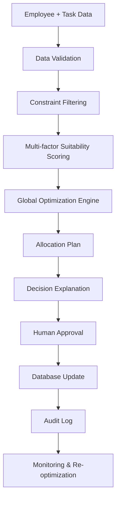

# WorkforceAI — Workforce Allocation & Decision Support

WorkforceAI is a deterministic workforce allocation and decision-support platform that assigns tasks to employees based on skills, availability, workload, SLA urgency, location, and historical performance. It combines transparent scoring, a global optimization layer, and a non-destructive scenario simulator so managers can review and approve changes before they are applied.

## Problem Statement
Modern teams often have more work than available people. Workforce planning is not a simple “best employee per task” problem. A good system must reason globally across workload, priority, SLA risk, availability, location and skill coverage, while still supporting human approval and clear explainability.

## Solution
The application applies the following workflow:

1. Observe active workforce and task demand
2. Analyze constraints and risk signals
3. Optimize allocations across the full workforce plan
4. Explain the decision using actual data
5. Simulate changes without mutating production data
6. Require human approval before applying a live change
7. Monitor the resulting impact and re-optimize as needed

## Key Features
- Employee management with skill, workload, location, and performance tracking
- Task queue with priority, SLA, and assignment state
- Multi-factor suitability scoring based on actual database values
- OR-Tools optimization layer for global assignment planning
- Dynamic scenario simulation for availability, SLA, critical-task and workload events
- Explainable assignment reasoning and summary generation
- Audit log for every operational decision and simulation outcome
- Dashboard with KPI cards and charts driven from live data
- Digital twin view comparing current vs simulated workforce states
- Human approval flow before applying major reallocation changes

## Innovation
This project demonstrates a realistic decision-support dashboard rather than a toy assignment demo. It avoids random assignments and hidden logic by using deterministic scoring, constraint checks, and a global optimization model. Optional LLM summarization is supported only for explanation text when an API key is available.

## Architecture



### Core components
- Flask backend and HTML/JS frontend
- SQLite database for local development
- Scoring and suitability engine
- OR-Tools optimization model
- AI agent explanation layer with deterministic fallback
- Scenario replay and audit flows

## Technology Stack
- Python 3.11+
- Flask
- SQLite
- OR-Tools
- HTML5, CSS3, JavaScript
- Bootstrap and Chart.js
- pytest

## System Workflow
The system supports the full decision cycle:

- OBSERVE
- ANALYZE
- OPTIMIZE
- EXPLAIN
- SIMULATE
- APPROVE
- APPLY
- MONITOR
- RE-OPTIMIZE

## Explainability Workflow
The optional LLM layer is intentionally limited to explanation and summary generation. It does not directly assign employees. The actual decision pipeline remains:

- Employee and task data
- Validation and filtering
- Multi-factor scoring
- Global optimization
- Decision explanation
- Human approval
- Database persistence
- Audit trail

If no API key is configured, the app uses deterministic explanations so the project remains fully functional.

## Optimization Approach
The optimizer evaluates each feasible employee-task pairing across the full workforce and solves a global assignment problem rather than selecting the top-scoring candidate for each task in isolation. This reduces poor planning outcomes where a local best choice blocks a better overall workforce plan.

### Prototype weights
The default scoring weights are:
- Skill match: 30%
- Availability: 20%
- Workload capacity: 15%
- Priority/SLA compatibility: 15%
- Location: 10%
- Historical performance: 10%

These are configurable prototype weights for this hackathon implementation and are not a prescribed business policy.

## Database Schema
The project uses SQLite with tables for:
- employees
- tasks
- allocations
- audit_logs
- scenario_runs
- alerts
- system_settings

## API Documentation
The app exposes REST endpoints including:
- GET /api/dashboard
- GET /api/employees
- GET /api/tasks
- GET /api/allocations
- GET /api/audit
- GET /api/alerts
- POST /api/allocate
- POST /api/reallocate
- POST /api/simulate
- POST /api/apply-simulation

## Installation
```bash
python -m venv venv
venv\Scripts\activate
python -m pip install --upgrade pip
pip install -r requirements.txt
```

Create a local environment file:
```bash
copy .env.example .env
```

Optional values:
```env
SECRET_KEY=change-me
PORT=5000
DATABASE_PATH=
LLM_API_KEY=
LLM_MODEL=gpt-4o-mini
```

## Running Locally
```bash
python app.py
```

The application listens on `0.0.0.0` and uses the `PORT` environment variable with a default of `5000`.

Open:
```text
http://127.0.0.1:5000/
```

## Testing
```bash
pytest -q
```

## Deployment
The project includes a Flask-compatible Dockerfile and a Procfile for easy deployment.

Example:
```bash
docker build -t workforceai .
docker run -p 5000:5000 workforceai
```

## Demo Workflow
A typical demonstration flow is:
1. Open the dashboard
2. Review workforce workload and task backlog
3. Run AI allocation
4. Simulate employee unavailability
5. Review before/after changes and explanation
6. Approve and apply the change
7. Inspect audit history and alerts

## Screenshots
The project is ready for screenshots to be added in the final presentation deck.

## Limitations
- This is a local-development prototype and uses SQLite by default.
- The optimizer is a transparent decision-support model rather than a production-grade autonomous planner.
- LLM-based explanation is optional and falls back to deterministic templates when unavailable.

## Future Enhancements
- PostgreSQL production configuration
- Authentication and role-based access
- Calendar-aware scheduling and time-off support
- More advanced multi-objective optimization tuning
- Rich reporting and export workflows

## Team Details
This project was developed as a hackathon prototype for workforce decision support and AI-assisted planning.

## Project Structure
- app.py — Flask application and route layer
- database.py — initialization, persistence, and data access helpers
- allocation_engine.py — scoring and allocation logic
- optimization_engine.py — OR-Tools global optimizer
- ai_agent.py — deterministic and optional LLM explanation helper
- templates/ — HTML views
- static/ — frontend assets
- tests/ — automated verification
